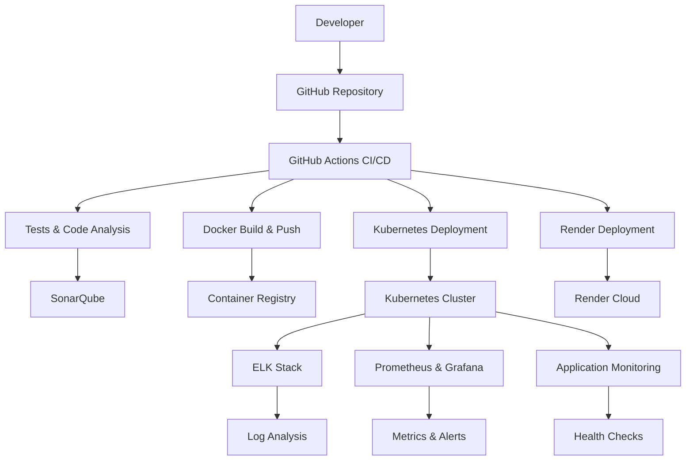

# 🚀 KDS Assurance - Pipeline DevOps Complet

Ce document décrit l'implémentation complète du pipeline DevOps pour le système KDS Assurance, incluant CI/CD, containerisation, monitoring, et déploiement automatisé.

## 📋 Table des matières

- [Architecture DevOps](#architecture-devops)
- [Technologies Utilisées](#technologies-utilisées)
- [Configuration Initiale](#configuration-initiale)
- [Pipeline CI/CD](#pipeline-cicd)
- [Déploiement](#déploiement)
- [Monitoring](#monitoring)
- [Maintenance](#maintenance)

## 🏗️ Architecture DevOps



## 🛠️ Technologies Utilisées

### **CI/CD & Orchestration**
- **GitHub Actions** : Pipeline CI/CD automatisé
- **Docker** : Containerisation des applications
- **Kubernetes** : Orchestration des conteneurs
- **Ansible** : Configuration et déploiement automatisé

### **Monitoring & Observabilité**
- **ELK Stack** : Elasticsearch, Logstash, Kibana
- **Prometheus** : Collecte de métriques
- **Grafana** : Dashboards et visualisation
- **SonarQube** : Analyse de qualité du code

### **Cloud & Infrastructure**
- **Render** : Déploiement cloud
- **GitHub Container Registry** : Stockage des images Docker
- **Let's Encrypt** : Certificats SSL automatiques

## ⚙️ Configuration Initiale

### **1. Prérequis**

```bash
# Outils requis
- Docker & Docker Compose
- kubectl
- Helm
- Ansible
- GitHub CLI
- Node.js 18+
- PHP 8.2+
```

### **2. Installation Automatique**

```bash
# Exécuter le script de configuration
chmod +x scripts/setup-devops.sh
./scripts/setup-devops.sh
```

### **3. Configuration Manuelle**

#### **GitHub Secrets**
```bash
# Secrets requis dans GitHub
SONAR_TOKEN=your_sonarcloud_token
KUBE_CONFIG=base64_encoded_kubeconfig
RENDER_SERVICE_ID=your_render_service_id
RENDER_API_KEY=your_render_api_key
SLACK_WEBHOOK=your_slack_webhook_url
```

#### **SonarCloud**
1. Créer un compte sur [SonarCloud](https://sonarcloud.io)
2. Importer le repository GitHub
3. Copier le token et l'ajouter aux secrets GitHub

#### **Kubernetes Cluster**
```bash
# Options de cluster
- Minikube (développement local)
- Kind (développement local)
- GKE (Google Cloud)
- EKS (AWS)
- AKS (Azure)
```

## 🔄 Pipeline CI/CD

### **Workflow GitHub Actions**

Le pipeline se déclenche automatiquement sur :
- Push sur `main` ou `develop`
- Pull requests vers `main`
- Déclenchement manuel

### **Étapes du Pipeline**

1. **🧪 Tests & Analyse**
   - Tests unitaires PHP (PHPUnit)
   - Tests frontend (Jest/Karma)
   - Analyse de code (SonarQube)
   - Tests de sécurité (PHPStan)

2. **🏗️ Build & Push**
   - Construction des images Docker
   - Push vers GitHub Container Registry
   - Scan de vulnérabilités

3. **☸️ Déploiement Kubernetes**
   - Application des manifests
   - Mise à jour des déploiements
   - Vérification de santé

4. **🚀 Déploiement Render**
   - Déploiement automatique sur Render
   - Configuration des variables d'environnement

5. **📊 Monitoring**
   - Déploiement ELK Stack
   - Configuration Prometheus & Grafana
   - Mise en place des alertes

## 🚀 Déploiement

### **Déploiement Automatique**

Le déploiement se fait automatiquement via GitHub Actions lors du push sur `main`.

### **Déploiement Manuel**

```bash
# Déploiement complet
chmod +x scripts/deploy.sh
./scripts/deploy.sh

# Options disponibles
./scripts/deploy.sh --help
./scripts/deploy.sh --build-only
./scripts/deploy.sh --k8s-only
./scripts/deploy.sh --monitoring
```

### **Déploiement avec Ansible**

```bash
# Configuration des serveurs
ansible-playbook -i ansible/inventory/hosts ansible/playbook.yml

# Variables requises
mysql_root_password: your_mysql_password
mysql_password: your_app_password
mail_password: your_mail_password
domain: your-domain.com
```

## 📊 Monitoring

### **ELK Stack**

- **Elasticsearch** : Stockage et indexation des logs
- **Logstash** : Traitement et transformation des logs
- **Kibana** : Visualisation et analyse des logs

**Accès** : `http://kibana-service.monitoring.svc.cluster.local:5601`

### **Prometheus & Grafana**

- **Prometheus** : Collecte de métriques
- **Grafana** : Dashboards et alertes

**Accès** :
- Prometheus : `http://prometheus-service.monitoring.svc.cluster.local:9090`
- Grafana : `http://grafana-service.monitoring.svc.cluster.local:3000`

### **Métriques Surveillées**

- **Application** : Temps de réponse, taux d'erreur, utilisation CPU/Mémoire
- **Infrastructure** : État des pods, utilisation des ressources
- **Base de données** : Connexions, requêtes lentes
- **Cache Redis** : Hit ratio, utilisation mémoire

### **Alertes Configurées**

- Taux d'erreur élevé (>10%)
- Utilisation mémoire élevée (>80%)
- Pods en crash loop
- Temps de réponse élevé (>2s)

## 🔧 Maintenance

### **Mise à jour des Applications**

```bash
# Mise à jour via Git
git push origin main

# Mise à jour manuelle des images
kubectl set image deployment/laravel-app laravel-app=ghcr.io/username/repo:new-tag
kubectl set image deployment/angular-app angular-app=ghcr.io/username/repo-frontend:new-tag
```

### **Sauvegarde des Données**

```bash
# Sauvegarde MySQL
kubectl exec -it mysql-pod -- mysqldump -u root -p kds_assurance > backup.sql

# Sauvegarde Redis
kubectl exec -it redis-pod -- redis-cli BGSAVE
```

### **Scaling**

```bash
# Scaling horizontal automatique (HPA)
kubectl get hpa

# Scaling manuel
kubectl scale deployment laravel-app --replicas=5
kubectl scale deployment angular-app --replicas=3
```

### **Logs et Debugging**

```bash
# Logs des applications
kubectl logs -f deployment/laravel-app -n kds-assurance
kubectl logs -f deployment/angular-app -n kds-assurance

# Logs du système
kubectl logs -f deployment/elasticsearch -n monitoring
kubectl logs -f deployment/prometheus -n monitoring
```

## 🚨 Dépannage

### **Problèmes Courants**

1. **Pipeline CI/CD échoue**
   ```bash
   # Vérifier les secrets GitHub
   gh secret list
   
   # Vérifier les logs GitHub Actions
   gh run list
   gh run view <run-id>
   ```

2. **Déploiement Kubernetes échoue**
   ```bash
   # Vérifier l'état des pods
   kubectl get pods -n kds-assurance
   kubectl describe pod <pod-name> -n kds-assurance
   
   # Vérifier les logs
   kubectl logs <pod-name> -n kds-assurance
   ```

3. **Monitoring non accessible**
   ```bash
   # Vérifier les services
   kubectl get services -n monitoring
   
   # Vérifier les ingress
   kubectl get ingress -n kds-assurance
   ```

### **Commandes Utiles**

```bash
# État général du cluster
kubectl get all --all-namespaces

# Ressources utilisées
kubectl top nodes
kubectl top pods -n kds-assurance

# Redémarrage des services
kubectl rollout restart deployment/laravel-app -n kds-assurance
kubectl rollout restart deployment/angular-app -n kds-assurance
```

## 📈 Optimisations

### **Performance**

- **Cache Redis** : Mise en cache des requêtes fréquentes
- **CDN** : Distribution de contenu statique
- **Compression** : Gzip activé sur Nginx
- **Optimisation des images** : Multi-stage builds Docker

### **Sécurité**

- **Secrets Kubernetes** : Gestion sécurisée des mots de passe
- **RBAC** : Contrôle d'accès basé sur les rôles
- **Network Policies** : Isolation réseau
- **Scan de vulnérabilités** : Intégration dans le pipeline

### **Coûts**

- **Auto-scaling** : Ajustement automatique des ressources
- **Spot instances** : Utilisation d'instances à prix réduit
- **Monitoring des coûts** : Alertes sur l'utilisation

## 📚 Ressources Supplémentaires

- [Documentation Kubernetes](https://kubernetes.io/docs/)
- [Documentation GitHub Actions](https://docs.github.com/en/actions)
- [Documentation Docker](https://docs.docker.com/)
- [Documentation Prometheus](https://prometheus.io/docs/)
- [Documentation Grafana](https://grafana.com/docs/)

## 🤝 Support

Pour toute question ou problème :

1. Vérifier les logs GitHub Actions
2. Consulter les dashboards de monitoring
3. Vérifier l'état des services Kubernetes
4. Consulter la documentation des outils utilisés

---

**🎉 Félicitations ! Votre pipeline DevOps est maintenant opérationnel !**
