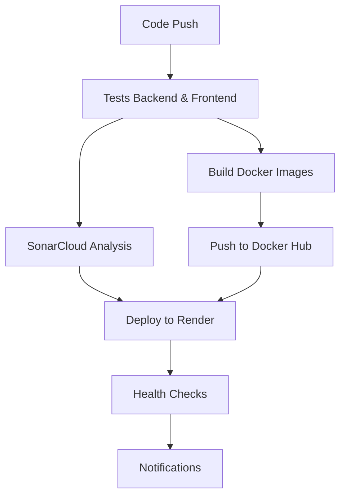

# 🚀 Pipeline DevOps Complet - MEMOIRE2

## 📋 Vue d'ensemble

Pipeline DevOps complet avec :
- ✅ **Tests** : Backend (PHP/Laravel) + Frontend (Angular)
- ✅ **Docker Hub** : Build et push des images Docker
- ✅ **SonarCloud** : Analyse de qualité de code
- ✅ **Render** : Déploiement automatique
- ✅ **Monitoring** : Tests de santé et notifications

## 🔄 Flux du Pipeline



## 📁 Fichiers du Pipeline

### **Workflow GitHub Actions**
- `.github/workflows/complete-pipeline.yml` - Pipeline principal

### **Dockerfiles**
- `backend/Dockerfile.pipeline` - Image Backend optimisée
- `frontend/Dockerfile.pipeline` - Image Frontend optimisée

### **Configurations**
- `sonar-project-pipeline.properties` - Configuration SonarCloud
- `render-pipeline.yaml` - Configuration Render

### **Scripts**
- `scripts/configure-pipeline-secrets.ps1` - Configuration des secrets

## 🔧 Configuration Requise

### **1. Secrets GitHub (OBLIGATOIRE)**

Allez sur : https://github.com/smd30/MEMOIRE2/settings/secrets/actions

Ajoutez ces secrets :

```
DOCKERHUB_USERNAME    # Votre nom d'utilisateur Docker Hub
DOCKERHUB_TOKEN       # Votre token Docker Hub
SONAR_TOKEN           # Votre token SonarCloud
RENDER_SERVICE_ID     # ID du service Render
RENDER_API_KEY        # Clé API Render
RENDER_SERVICE_URL    # URL du service Render
```

### **2. Comptes Externes**

#### **Docker Hub**
- URL : https://hub.docker.com
- Créer un compte gratuit
- Générer un token d'accès

#### **SonarCloud**
- URL : https://sonarcloud.io
- Connecter avec GitHub
- Créer un projet pour MEMOIRE2

#### **Render**
- URL : https://render.com
- Créer un compte gratuit
- Créer un service web + base de données

## 🚀 Déploiement

### **1. Configuration des secrets**
```powershell
.\scripts\configure-pipeline-secrets.ps1
```

### **2. Pousser le code**
```powershell
git add .
git commit -m "🚀 Pipeline DevOps complet"
git push origin main
```

### **3. Vérifier le pipeline**
- Allez sur : https://github.com/smd30/MEMOIRE2/actions
- Vérifiez que "Pipeline DevOps Complet" s'exécute

## 📊 Jobs du Pipeline

### **Job 1 : Tests & Validation**
- Tests PHP/Laravel avec MySQL
- Tests Angular avec Chrome Headless
- Génération des rapports de couverture
- Build du frontend

### **Job 2 : Build & Push Docker Images**
- Construction des images Docker
- Push vers Docker Hub
- Cache optimisé

### **Job 3 : Analyse SonarCloud**
- Analyse de qualité de code
- Rapports de couverture
- Détection de vulnérabilités

### **Job 4 : Déploiement Render**
- Déploiement automatique
- Configuration des variables d'environnement
- Migration de base de données

### **Job 5 : Tests de Déploiement**
- Vérification de santé de l'API
- Test de connexion base de données
- Validation du déploiement

### **Job 6 : Notifications**
- Notifications de succès/échec
- Résumé du pipeline

## 🔍 Monitoring

### **Endpoints de Santé**
- **API** : `https://votre-service.onrender.com/api/health`
- **Base de données** : `https://votre-service.onrender.com/api/health/database`

### **Services**
- **GitHub Actions** : https://github.com/smd30/MEMOIRE2/actions
- **Docker Hub** : https://hub.docker.com/u/votre-username
- **SonarCloud** : https://sonarcloud.io/project/overview?id=memoire2
- **Render** : https://render.com/dashboard

## ❓ Résolution de Problèmes

### **Pipeline échoue au début**
- Vérifiez que tous les secrets sont configurés
- Vérifiez les permissions des comptes externes

### **Tests échouent**
- Vérifiez la configuration de la base de données MySQL
- Vérifiez les dépendances PHP et Node.js

### **Docker Hub échoue**
- Vérifiez DOCKERHUB_USERNAME et DOCKERHUB_TOKEN
- Vérifiez les permissions du token Docker Hub

### **SonarCloud échoue**
- Vérifiez SONAR_TOKEN
- Vérifiez que le projet SonarCloud existe

### **Render échoue**
- Vérifiez RENDER_SERVICE_ID et RENDER_API_KEY
- Vérifiez la configuration du service Render

## 🎯 Avantages du Pipeline

### **✅ Automatisation Complète**
- Déploiement automatique à chaque push
- Tests automatiques
- Analyse de qualité automatique

### **✅ Qualité Assurée**
- Tests unitaires et d'intégration
- Analyse SonarCloud
- Validation de déploiement

### **✅ Monitoring Intégré**
- Endpoints de santé
- Notifications automatiques
- Logs détaillés

### **✅ Scalabilité**
- Images Docker réutilisables
- Configuration cloud-native
- Pipeline modulaire

## 🚀 Prochaines Étapes

1. **Configurez les secrets** GitHub
2. **Créez les comptes** externes
3. **Poussez le code** pour déclencher le pipeline
4. **Vérifiez** que tout fonctionne
5. **Monitorer** les déploiements

---

**🎉 Votre pipeline DevOps complet est prêt !**

**Suivez les étapes de configuration et votre application sera déployée automatiquement à chaque modification de code.**
